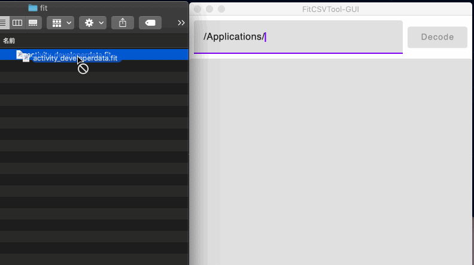

fit-csv-tool-gui
===============

# Demo



# Features

- Decode the Fit file to csv.
- Drag-and-drop support.

# Requirement

- IntelliJ IDEA CE
- Java 11 or higher

# Usage

```zsh
./gradlew run
```
